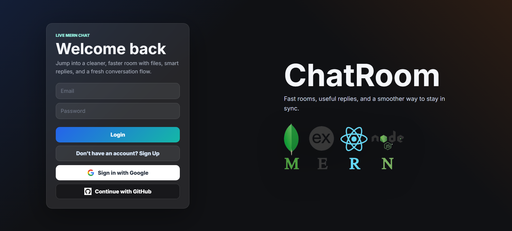

# ChatRoom — AI Powered MERN Chat Application



ChatRoom is a real-time chat application built with the MERN stack and enhanced with AI-powered smart replies, file sharing, and social authentication.

## Key Features

- Real-time one-to-one and group messaging (Socket.IO)
- AI-powered reply suggestions to speed up conversations
- File upload and sharing (images, documents, media)
- JWT + OAuth (Google, GitHub) authentication
- Presence indicators and typing notifications
- Responsive React frontend with smooth UI/UX

## Repository Layout

- `Back/` — Express backend, API routes, authentication, Socket.IO server
- `front/` — React frontend, UI components, file upload and AI integration

## Prerequisites

- Node.js (>= 16) and npm
- MongoDB instance (local or cloud)
- (Optional) Cloudinary / S3 account for file storage
- (Optional) OpenAI API key for AI replies

## Environment variables

Create a `.env` in `Back/` and `front/` as needed. Example variables for `Back/.env`:

```
PORT=5000
MONGO_URI=your_mongo_connection_string
JWT_SECRET=your_jwt_secret
CLOUDINARY_CLOUD_NAME=...
CLOUDINARY_API_KEY=...
CLOUDINARY_API_SECRET=...
OPENAI_API_KEY=...
GOOGLE_CLIENT_ID=...
GOOGLE_CLIENT_SECRET=...
GITHUB_CLIENT_ID=...
GITHUB_CLIENT_SECRET=...
```

For the frontend (`front/.env`) you may set the API URL and any public keys:

```
REACT_APP_API_URL=http://localhost:5000
REACT_APP_OPENAI_KEY=your_openai_key_optional
```

## Local development

1. Start the backend

```bash
cd Back
npm install
# use nodemon if available
npm run dev # or: node server.js
```

2. Start the frontend

```bash
cd front
npm install
npm start
```

Open `http://localhost:3000` in your browser (or the port configured by the frontend).

## Build for production

```bash
cd front
npm run build
# serve the build folder or integrate with your backend/static host
```

## Deployment notes

- Secure required secrets (`MONGO_URI`, `JWT_SECRET`, API keys) in your hosting provider.
- Use a process manager (pm2) or containerization for the backend.
- Configure CORS and production proxy for the frontend to talk to the backend.

## Troubleshooting

- If images don't show on GitHub, ensure paths are relative to the README location (this README expects images in `public/img/`).
- Verify `.env` values and that backend is reachable from frontend (CORS, correct `REACT_APP_API_URL`).

## Contributing

Contributions are welcome. Open an issue or submit a pull request with a clear description of changes.

## License

MIT License

---

If you want I can further tailor this README with command examples from your `package.json` scripts or add screenshots and badges.
